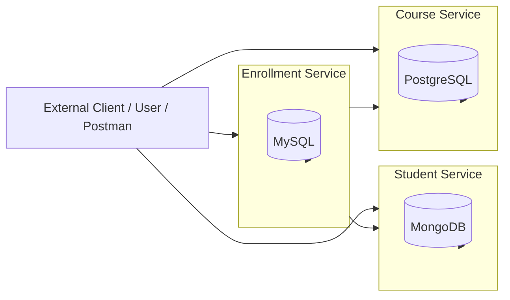
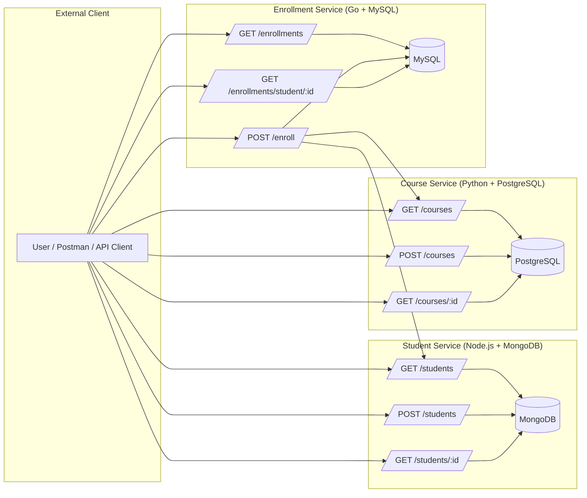
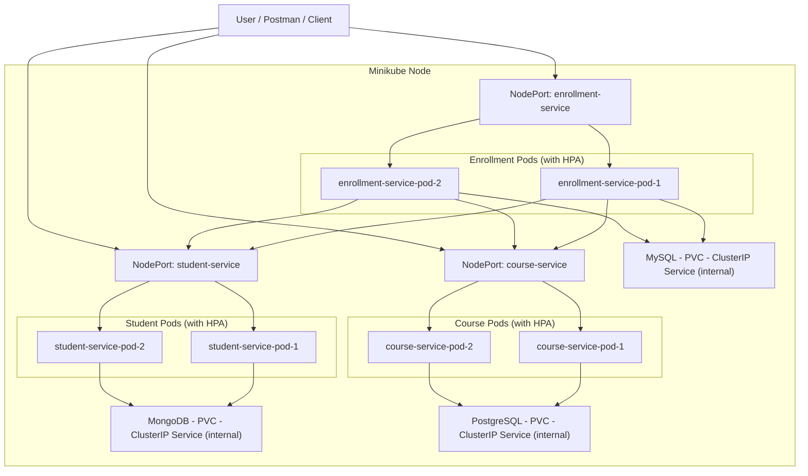

# 🎓 Student-Course-App — Microservices Ecosystem


---

## 🧩 Overview

**Student-Course-App** is a cloud-native microservices ecosystem built to manage students, courses, and enrollments.
It consists of three independent services:

1. **Student Service** — manages student data (Node.js + MongoDB)
2. **Course Service** — manages courses (Python + Flask + PostgreSQL)
3. **Enrollment Service** — manages student-course enrollments (Go + Gin + MySQL)

Each service exposes REST APIs, is containerized with Docker, and can be orchestrated via Kubernetes. Together, they ensure **modularity, scalability, and reliable coordination** between students and courses.

---

## 🏗️ Architecture Diagram

#### Simple Application Architeture Diagram:



#### Detailed Architeture Diagram showing all Workflows:



#### Detailed Architecture When Project Is Onboarded into Kubernetes:



---

## ⚙️ Technology Stack

| Layer                  | Technology                  | Purpose                                          |
| ---------------------- | --------------------------- | ------------------------------------------------ |
| **Student Service**    | Node.js + MongoDB           | Stores and manages student records               |
| **Course Service**     | Python + Flask + PostgreSQL | Stores and manages courses                       |
| **Enrollment Service** | Go + Gin + MySQL            | Manages enrollments between students and courses |
| **Containerization**   | Docker                      | Environment encapsulation                        |
| **Orchestration**      | Kubernetes                  | Deployment, scaling, and service discovery       |

---

## 📂 Directory Structure

```
root/
├── docker-compose.yaml
├── student-service/
│   ├── app.js
│   ├── Dockerfile
│   ├── package.json
│   ├── mongo.yaml
│   └── student-service.yaml
├── course-service/
│   ├── main.py
│   ├── Dockerfile
│   ├── requirements.txt
│   ├── postgres.yaml
│   └── course-service.yaml
├── enrollment-service/
│   ├── main.go
│   ├── Dockerfile
│   ├── go.mod
│   ├── go.sum
│   ├── mysql.yaml
│   └── enrollment-service.yaml
└── README.md
```

---

## 🚀 Setup Guide

### 1️⃣ Local Docker Compose

1. Ensure **Docker daemon is running**.
2. In the project root, run:

```bash
docker compose up --build
```

3. All services (MongoDB, PostgreSQL, MySQL + microservices) will start locally.

---

### 2️⃣ Minikube / Kubernetes Deployment

1. Point Docker CLI to Minikube:

```bash
eval $(minikube docker-env)
```

2. Build service images locally:

```bash
docker build -t student-service:latest ./student-service
docker build -t course-service:latest ./course-service
docker build -t enrollment-service:latest ./enrollment-service
```

3. Apply database manifests:

```bash
kubectl apply -f student-service/mongo.yaml
kubectl apply -f course-service/postgres.yaml
kubectl apply -f enrollment-service/mysql.yaml
```

4. Deploy services:

```bash
kubectl apply -f student-service/student-service.yaml
kubectl apply -f course-service/course-service.yaml
kubectl apply -f enrollment-service/enrollment-service.yaml
```

5. Verify pods and services:

```bash
kubectl get pods
kubectl get svc
```

6. Access services via `<minikube_ip>:<forwarded_port>` in Postman or curl.

---

### 3️⃣ Load Testing / HPA Verification

Simulate CPU load to observe **Horizontal Pod Autoscaler** behavior:

```bash
seq 10000 | xargs -n1 -P20 -I{} curl -s -o /dev/null http://localhost:5001/courses
```

---

## 🧪 API Testing

Replace `<minikube_ip>` and `<port>` with your actual IP/port.

---

### **Student Service**

**1. Health Check**

```bash
curl -X GET 'http://<minikube_ip>:<student_service_port>/'
```

**2. Add Students (POST /students)**

```bash
curl -X POST -H "Content-Type: application/json" -d '{ "name": "Krushna", "email": "krushna@kr.com"}' 'http://<minikube_ip>:<student_service_port>/students'
```

**3. Fetch All Students (GET /students)**

```bash
curl -X GET 'http://<minikube_ip>:<student_service_port>/students' | jq
```

**4. Fetch Single Student (GET /students/:id)**

```bash
curl -X GET 'http://<minikube_ip>:<student_service_port>/students/<student_id>'
```

---

### **Course Service**

**1. Health Check**

```bash
curl -X GET 'http://<minikube_ip>:<course_service_port>/'
```

**2. Add Courses (POST /courses)**

```bash
curl -X POST -H "Content-Type: application/json" -d '{ "title": "Physics", "instructor": "Bob", "credits": 4}' 'http://<minikube_ip>:<course_service_port>/courses'
```

**3. Fetch All Courses (GET /courses)**

```bash
curl -X GET 'http://<minikube_ip>:<course_service_port>/courses' | jq
```

**4. Fetch Single Course (GET /courses/:id)**

```bash
curl -X GET 'http://<minikube_ip>:<course_service_port>/courses/<course_id>'
```

---

### **Enrollment Service**

**1. Health Check**

```bash
curl -X GET 'http://<minikube_ip>:<enrollment_service_port>/'
```

**2. Enroll Student (POST /enroll)**

```bash
curl -X POST -H "Content-Type: application/json" -d '{ "student_id": 1, "course_id": 2}' 'http://<minikube_ip>:<enrollment_service_port>/enroll'
```

**3. Fetch All Enrollments (GET /enrollments)**

```bash
curl -X GET 'http://<minikube_ip>:<enrollment_service_port>/enrollments'
```

**4. Fetch Enrollments for a Student (GET /enrollments/student/:id)**

```bash
curl -X GET 'http://<minikube_ip>:<enrollment_service_port>/enrollments/student/<student_id>'
```

---

## ⚡ Scalability & Reliability

* **Horizontal Pod Autoscaler (HPA)** for CPU-based dynamic scaling
* **Readiness & Liveness Probes** for health monitoring
* **PersistentVolumeClaims (PVCs)** ensure data durability across pod restarts

---

## ❤️ Contributors

| Name                                                      | Role                                |
| --------------------------------------------------------- | ----------------------------------- |
| [Siddharth Jain](https://github.com/2024mt03040-web)      | Lead Developer (Course Service)     |
| [Tanuja RY](https://github.com/tanujary)                  | Lead Developer (Student Service)    |
| [Aarya Nanndaann Singh M N](https://github.com/Aarya5122) | Lead Developer (Enrollment Service) |
| [Devesh Singh](https://github.com/2024mt03089-devesh)     | Contributor (Docker & GitHub Action)|
| [KP Sahoo](https://github.com/Krushna-Prasad-Sahoo/)      | Contributor (K8s) & Maintainer      |

---

## ⚖️ License

This project is licensed under the **MIT License** — you may freely use, modify, and distribute it.

---

> *“Microservices are not just about dividing code — they’re about dividing responsibilities.”*

---
